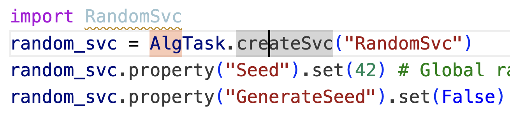

# 完整重建流程
* 包括 General、 Digitization、 BkgDigiMixing、 Reconstruction、 Classic Global PID 和 SummaryWriter六个部分。
  - 每个部分里面会包含多种调用：
  1. createSvc：调用服务（相当于算法的依赖项）
     
  3. createAlg：调用算法
  4. createGeo：调用一些探测器几何的模块
 

